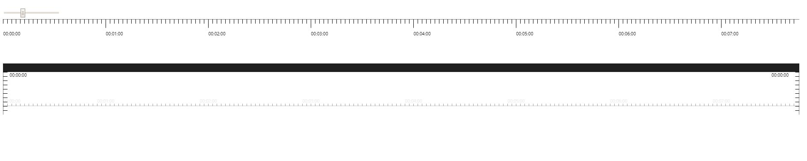

# canvas-timeliner



## Options

```
export interface IOptions {
  container: HTMLElement;
  position: string;
  textPos: number;
  textAlign: string;
  gap: number;
  width: number;
  height: number;
  lineOffset: number;
  gapHeight: number;
  gapColor: number;
  lineColor: string;
  lineWidth: number;
  lineHeight: number;
  interval: number;
  textSize: string;
  textStyle: string;
  autoSize: boolean;
  formatMarkText: (mark: number | string) => string;
}
```

### default options

```
const DEFAULT_OPTIONS: object = {
  height: 100,
  textSize: 10,
  interval: 10,
  gap: 10,
  textPos: 5,
  gapHeight: 20,
  lineHeight: 10,
  lineWidth: 1,
  lineColor: 'rgb(0, 0, 0)',
  textStyle: '#000000'
}
```


## Method

  * render(options?) redraw to canvas

```
const instance = new CanvasRuler(options?)
// resize ruler
instance.render({
  width: 3000,
  interval: 10,
  gap: 20
})
```

## Development

```bash
yarn dev
```
